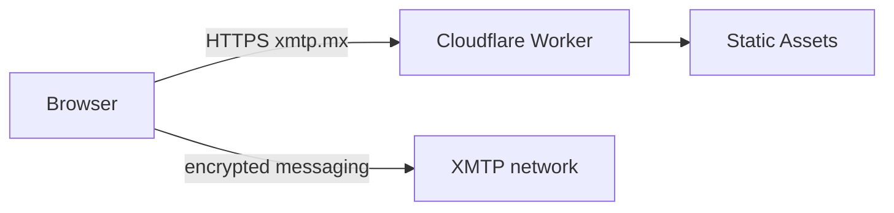

# Cloudflare frontend deployment runbook

The browser application remains a static Next.js export. Cloudflare Workers
Static Assets serves `out/`; XMTP and wallet operations remain client-side.



The three Wrangler files have deliberately different roles:

- `wrangler.jsonc`: isolated `xmtp-mx-frontend-staging` Worker.
- `wrangler.production-preview.jsonc`: the route-free
  `xmtp-mx-frontend` identity used to upload immutable candidate versions and
  create version preview aliases.
- `wrangler.production.jsonc`: the same production identity plus the
  `xmtp.mx` Custom Domain. It is used only by `wrangler triggers deploy`
  during the initial cutover.

After the production Worker exists, a release must use Workers Versions:
upload a version, test that exact version through its preview alias, then
promote its tag to 100% traffic. A full `wrangler deploy` to the production
identity after cutover would bypass that guarantee and is forbidden.

The legacy Pages workflow remains a rollback path until the live Cloudflare
deployment and wallet/XMTP behavior have been verified.

## GitHub configuration

Create these protected GitHub Environments:

- `cloudflare-staging`: Workers Scripts edit access, with no zone permission.
- `cloudflare-production-preview`: Workers Scripts edit access, with no zone
  permission. Require a reviewer for candidate/bootstrap operations.
- `cloudflare-production`: Workers Scripts edit plus Workers Routes/Custom
  Domains access limited to the `xmtp.mx` zone. Require a reviewer.

Set `CLOUDFLARE_ACCOUNT_ID` and `CLOUDFLARE_API_TOKEN` as secrets in each
applicable environment. Set the existing browser build values as repository
secrets because the validation job builds before entering an environment:

- `NEXT_PUBLIC_WALLETCONNECT_PROJECT_ID` (optional; enables WalletConnect and must be registered for xmtp.mx)
- `NEXT_PUBLIC_MAINNET_RPC_URL` (recommended)

Set these environment or repository variables:

- `CLOUDFLARE_FRONTEND_SMOKE_URL`: exact `workers.dev` URL for staging or
  the route-free production Worker, scoped to the corresponding environment.
- `CLOUDFLARE_WORKERS_SUBDOMAIN`: account Workers subdomain, on
  `cloudflare-production-preview`.
- `CLOUDFLARE_FRONTEND_CUTOVER_COMPLETE`: `false` initially in both
  production environments; change it to `true` only after live verification.
- `CLOUDFLARE_FRONTEND_AUTO_DEPLOY`: leave unset/false until cutover is
  healthy; `true` makes future pushes upload, test, and promote a version.

`NEXT_PUBLIC_*` values are visible in the browser bundle. No relay private
key, Cloudflare token, or XMTP secret belongs in this repository.

## DNS prerequisite and cutover

As observed on 2026-08-26, `xmtp.mx` still uses Namecheap nameservers
`dns1.registrar-servers.com` and `dns2.registrar-servers.com`. The apex has
only the GitHub Pages A records `185.199.109.153` and `185.199.110.153`; no
public MX, TXT, CAA, `www`, or relay subdomain records were visible.

1. Add `xmtp.mx` as a full zone in Cloudflare and let the DNS scan complete.
2. Before changing nameservers, confirm the imported zone retains both current
   GitHub Pages A records. They keep the old frontend serving while the
   nameserver change propagates.
3. Copy the exact Mailgun MX, SPF, DKIM, tracking, and verification records
   from the Mailgun domain screen into Cloudflare. Do not guess DKIM values or
   publish a second SPF record; merge authorized senders into one SPF record.
   Keep mail records DNS-only unless Mailgun explicitly requires otherwise.
4. In Namecheap, replace BasicDNS with the two nameservers Cloudflare assigns.
5. Wait for the Cloudflare zone to become **Active**, then verify the imported
   GitHub site and public NS, A/CNAME, MX, TXT, and CAA answers before running
   the production Worker cutover below.

The `wrangler.production.jsonc` Custom Domain trigger performs the frontend
record change after the zone is active. Do not create `www.xmtp.mx` unless a
`www` redirect is intentionally wanted. Do not change Mailgun's webhook route
or create `relay.xmtp.mx` as part of the frontend cutover.

## Validation and staging

Use Node.js 22 or newer:

```bash
npm ci
NEXT_PUBLIC_BASE_PATH= npm run build
npm run lint
npm run cloudflare:dry-run:staging
npm run cloudflare:dry-run:production-candidate
npm run cloudflare:dry-run:production
```

Deploy only the isolated staging Worker locally:

```bash
npm run cloudflare:deploy:staging
```

Verify the printed `workers.dev` URL:

1. `/`, `favicon.ico`, and referenced `/_next/static/` assets return 200.
2. Missing paths return the exported 404 page.
3. An EOA and a smart account connect through the wagmi wallet chooser and bind to their existing XMTP inboxes.
4. The existing XMTP inbox loads; compose, reply, refresh, and direct routes
   work.
5. Fonts, WebAssembly assets, PWA metadata, and offline cached behavior match
   the current site.

Cloudflare builds must use an empty `NEXT_PUBLIC_BASE_PATH`. A Wrangler dry
run validates only the bundle and config; it does not prove credentials, DNS,
or browser/XMTP behavior. The workflow stamps
`out/cloudflare-deployment.txt` and verifies that exact commit, Cloudflare
headers, assets, and 404 behavior after every real deployment.

## One-time production bootstrap and cutover

Use the `Deploy frontend to Cloudflare` workflow from `main`:

1. Run `target=staging` and complete the browser checks above.
2. Before any custom domain is attached, run
   `target=production-bootstrap` once. This creates the route-free production
   Worker. The job refuses to run after
   `CLOUDFLARE_FRONTEND_CUTOVER_COMPLETE=true`.
3. Run `target=cutover`. The workflow uploads an immutable version, tests its
   preview alias, waits for approval in `cloudflare-production`, promotes the
   exact tested tag, and only then applies the `xmtp.mx` Custom Domain
   trigger.
4. Verify `https://xmtp.mx/` from a clean browser and repeat all wallet, XMTP,
   route, asset, and PWA checks.
5. Confirm that mail MX/TXT records remain intact; the frontend cutover must
   not change mail routing.
6. Set `CLOUDFLARE_FRONTEND_CUTOVER_COMPLETE=true` in both production
   environments. Enable `CLOUDFLARE_FRONTEND_AUTO_DEPLOY` only if automatic
   main releases are desired.

For later releases, use `target=production-release`. Never use
`npm run cloudflare:bootstrap:production` after the custom domain exists.
The lower-level `cloudflare:upload:production` and
`cloudflare:cutover:production` scripts are operator primitives and require
the same preview, approval, and exact-version checks performed by the
workflow.

Do not remove `.github/workflows/pages.yml` or `public/.nojekyll` until the
live workflow check, wallet connection, existing XMTP inbox, compose/reply,
direct routes, and asset checks all pass and a Pages rollback has been
recorded.

## Rollback

For an application regression, use `wrangler versions deploy` to restore the
last known-good production version tag. This preserves the Custom Domain and
is the fastest rollback.

For a Cloudflare hosting or zone incident:

1. Disable `CLOUDFLARE_FRONTEND_AUTO_DEPLOY`.
2. Remove the `xmtp.mx` Custom Domain trigger from
   `xmtp-mx-frontend`.
3. Restore the saved GitHub Pages DNS records and repository Pages custom
   domain.
4. Re-run `.github/workflows/pages.yml` and verify `https://xmtp.mx/`.

Frontend rollback does not change the relay, MX records, XMTP identity, mail
state, or encrypted browser storage.

## Current production state

On 2026-08-27, `xmtp.mx` was attached as a Custom Domain to
`xmtp-mx-frontend`. Cloudflare authoritative DNS replaced the two GitHub Pages
A records with proxied Cloudflare A/AAAA answers. Production Worker version
`0fbbf498-9599-4b01-bf70-e71c4547eff4` serves commit
`c8e8545ce70437898498eae963d666f09906d457`.

The first public verification may still reach GitHub until recursive caches
expire. Verify authoritative DNS and the Worker directly before treating this
as a failed cutover; in this cutover, the former A records remained in one
local cache for about 25 minutes even though Cloudflare, Google, and Quad9
already returned the new answers. Keep GitHub Pages as rollback until normal
recursive resolution and clean-browser wallet/XMTP behavior are verified.
